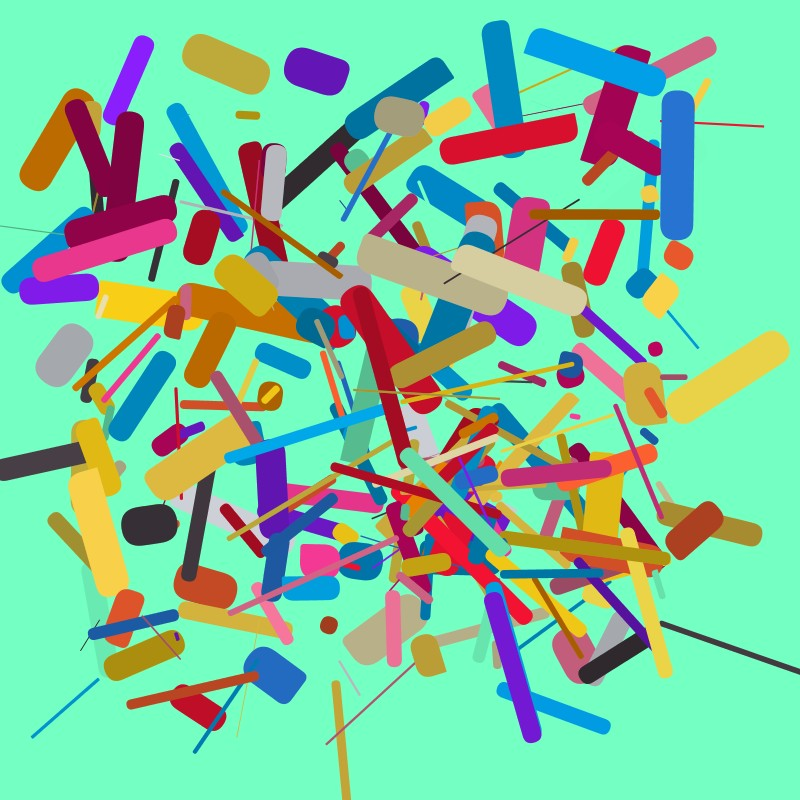

# Collage
Geometric arrangment of randomly tranformed rectangles

## How it works
- ``Collage.pde`` Main sketch file where the composition is defined
- - ``colors.pde`` A list of colors and a method for a random color form the list
- - ``composition.pde`` A function that renders a customizable grid with shapes on the canvas
- - ``shapes.pde`` A function that can draw multiple shapes within the grid

## Demo output

